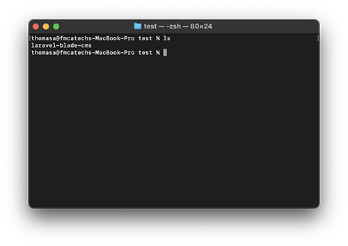
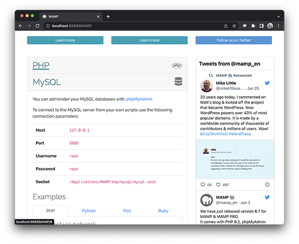
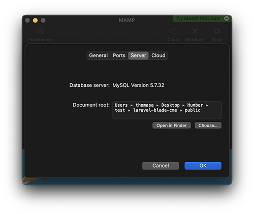

# Laravel CMS using Blade Views

This repository is a copy of the simple [PHP/Laravel CMS](https://github.com/codeadamca/php-cms-laravel) except the CMS views have been converted from vanilla PHP to Blade.

For these instructions I'm going to us MAMP as my development environment. But you could upload this application to a host, deploy using Docker, or the Laravel built in server.

## Windows

A few notes For Windows Machines:

1. A Laravel application deploy locall on MAMP seems to have problems running on a Windows computer inside the ```OneDrive``` folder. Make sure your project folder is outside of your ```OneDrive``` folder.

2. When PHP is downloaded for Windows, the ```php.ini``` file will default to having ```fileinfo```, ```zip```, and ```pdo_mysql``` disabled. You may need to anable these inside the ```php.ini``` file. This file is likely located at ```c:/PHP/php.ini```. Open this file and make the following changes:

    Enable the following three lines:

    ```
    ;extension=pdo_mysql
    ;extension=fileinfo
    ;extension=zip
    ```

    And remove the semi-colon:

    ```
    extension=pdo_mysql
    extension=fileinfo
    extension=zip
    ```

## Setup

To set up this CMS follow these steps:

1. Using your Terminal (or Git Bash on Windows), navigate to your working folder:

    ```
    $ cd <FOLDER_NAME>
    $ ls
    ```

    Note: On a Wiindows machine use ```dir``` to view the files in the current folder:

    ```
    $ dir
    ```

2. Clone this repo:

    ```
    $ git clone https://github.com/codeadamca/laravel-blade-cms.git
    ```

3. Using the Terminal, use ```ls``` on a Mac ot ```dir``` on a Windows machine to view the files in the current directory:

    

    You should now see a folder named ```laravel-blade-cms```. Change the present working directory to your new folder:

    ```
    $ cd laravel-blade-cms
    ```

4. Using the Terminal (or Git Bash), run ```composer update```:

    ```
    $ composer update
    ```

5. We need to setup the database connection. 

    Using MAMP and phpMyAdmin, create a new databse. 

    Make a copy the ```.env.sample``` file and name it ```.env```. Update the new ```.env``` file with your database credentials:

    ```php
    DB_CONNECTION=mysql
    DB_HOST=127.0.0.1
    DB_PORT=3306
    DB_DATABASE=<DATABASE_NAME>
    DB_USERNAME=root
    DB_PASSWORD=root
    ```

    On a Mac I also need to define the socket. Under ```DB_PASSWORD``` I'm going to add:

    ```php
    DB_SOCKET=/Applications/MAMP/tmp/mysql/mysql.sock
    ```

    Your socket setting may be different. When your MAMP server is up and running, open the MAMP start page (http://:8888/MAMP), go to the MySQL tab, and your socket location will be listed:

    

    The database setup included with this applications includes migrations and seeding. Run the following command to create the required tables and seed them with testing data:

    ```
    $ php artisan migrate:refresh --seed
    ```

6. Update your ```.env``` file to use the ```public``` file system:

    ```php
    FILESYSTEM_DRIVER=public
    ```

    And then run this command using the Terminal:

    ```
    $ php artisan storage:link
    ```

7. Opne up your MAMP preferences and set the document root to the ```public``` folder in your ```laravel-blade-cms``` folder:

    

    Restart MAMP. 

8. Using a Terminal, create an app key:

    ```
    php artisan key:generate
    ```

9. Test!

    To view the public front end go to http://localhost:8888/ on a Mac or http://localhost/ on a Windows machine. This may be different based on your MAMP configuration. 

10. To log in to the admin, use the URL http://localhost:8888/console/login on a Mac or http://localhost/console/login on a Windows machine. This may be different based on your MAMP configuration. 

    You will need to look up the email addresses in the ```user``` table and the default password is "password".

***

## Repo Resources

* [Visual Studio Code](https://code.visualstudio.com/)
* [Laravel](https://laravel.com/)

Full tutorial URL: https://codeadam.ca/learning/php-cms-laravel.html

<a href="https://codeadam.ca">

</a>
